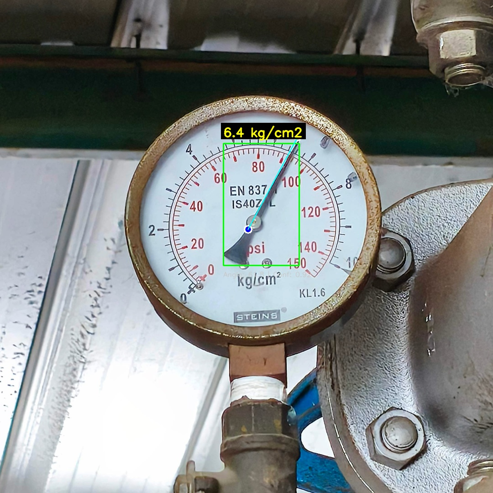
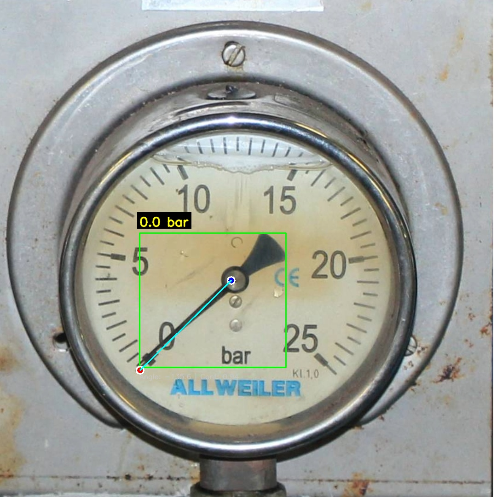

# Gauge Meter Analog Reading — Real-Time

Pembacaan gauge meter analog secara real-time menggunakan **YOLOv8 Pose model**. Program mendeteksi keypoints pada gauge (titik pusat + ujung jarum), menghitung sudut jarum, lalu memetakan ke nilai pembacaan gauge.

---

## Project Structure

```
gauge_meter_analog_reading_realtime/
├── README.md                          # Dokumentasi project
├── app/
│   ├── __init__.py
│   └── main.py                        # Entry point (image / webcam / RTSP)
├── config/
│   ├── gauge_config.yaml              # Config gauge kg/cm2 (default)
│   └── gauge_config_bar.yaml          # Config gauge bar
├── data_test/                         # Folder gambar testing
│   ├── test_image.png
│   ├── test_image2.png
│   └── test_image3.png
├── internal/
│   ├── __init__.py
│   └── ai_runtime/
│       ├── __init__.py
│       ├── gauge_read.py              # Bridge import module
│       └── gauge-pose/
│           ├── __init__.py
│           └── gauge_read.py          # Core GaugeReader class (logic utama)
├── models/
│   └── gauge-pose.pt                  # YOLOv8 Pose model (pre-trained)
└── test/
    ├── test_gauge_read.py             # Script pengetesan otomatis
    └── output/                        # Hasil output test
        ├── test_result.jpg
        └── test_result_bar.jpg
```

---

## Requirements

- Python 3.10+
- ultralytics
- opencv-python-headless
- numpy
- pyyaml

---

## Instalasi

```bash
cd /home/ozzaann/gauge_model/gauge_meter_analog_reading_realtime

# Buat virtual environment
python3 -m venv .gauge_meter

# Aktifkan environment
source .gauge_meter/bin/activate

# Install dependencies
pip install ultralytics opencv-python-headless numpy pyyaml
```

---

## Cara Menjalankan

Semua command dijalankan dari folder **root project** (`/home/ozzaann/gauge_model`):

```bash
cd /home/ozzaann/gauge_model
source gauge_meter_analog_reading_realtime/.gauge_meter/bin/activate
```

### Mode Image (Default)

Membaca gauge dari file gambar:

```bash
# Menggunakan config default (kg/cm2)
python -m gauge_meter_analog_reading_realtime.app.main

# Menggunakan config bar
python -m gauge_meter_analog_reading_realtime.app.main \
  --config gauge_meter_analog_reading_realtime/config/gauge_config_bar.yaml

# Override gambar
python -m gauge_meter_analog_reading_realtime.app.main \
  --image data_test/test_image.png
```

### Mode Webcam

Pembacaan real-time dari webcam:

```bash
python -m gauge_meter_analog_reading_realtime.app.main --mode webcam
```

### Mode RTSP

Pembacaan real-time dari RTSP stream:

```bash
python -m gauge_meter_analog_reading_realtime.app.main --mode rtsp
```

> **Note:** Pastikan `source.rtsp_url` sudah diisi di file config sebelum menggunakan mode RTSP.

### Parameter CLI

| Parameter    | Default                                                        | Keterangan                          |
|-------------|----------------------------------------------------------------|-------------------------------------|
| `--config`  | `gauge_meter_analog_reading_realtime/config/gauge_config.yaml` | Path ke file config YAML            |
| `--mode`    | Dari config (`source.type`)                                    | `image`, `webcam`, atau `rtsp`      |
| `--image`   | Dari config (`source.path`)                                    | Override path gambar                |

---

## Menjalankan Test

```bash
cd /home/ozzaann/gauge_model
source gauge_meter_analog_reading_realtime/.gauge_meter/bin/activate

python -m gauge_meter_analog_reading_realtime.test.test_gauge_read
```

Hasil test akan tersimpan di `test/output/`.

### Contoh Hasil Pembacaan

#### Gauge kg/cm2 (test_image.png → 6.40 kg/cm2)



#### Gauge bar (test_image2.png → 0.02 bar)



#### Ringkasan Hasil Test

| Gauge          | Nilai Aktual | Hasil Prediksi | Error | Confidence |
|---------------|-------------|----------------|-------|------------|
| 0-10 kg/cm2   | ~6.4 kg/cm2 | **6.40 kg/cm2**| 0.00  | 91.8%      |
| 0-25 bar      | ~0.02 bar   | **0.02 bar**   | 0.00  | 93.8%      |

---

## Format Config

File config menggunakan format YAML. Berikut struktur lengkapnya:

```yaml
model:
  path: "gauge_meter_analog_reading_realtime/models/gauge-pose.pt"
  confidence: 0.5          # Confidence threshold deteksi (0.0 - 1.0)

gauge:
  min_value: 0             # Nilai minimum pada gauge
  max_value: 10            # Nilai maksimum pada gauge
  min_angle: 220           # Sudut (derajat) pada posisi min_value
  max_angle: -27           # Sudut (derajat) pada posisi max_value
  unit: "kg/cm2"           # Satuan yang digunakan

source:
  type: "image"            # "image", "webcam", atau "rtsp"
  path: "test_image.png"   # Path gambar (untuk mode image)
  webcam_id: 0             # ID webcam (untuk mode webcam)
  rtsp_url: ""             # URL RTSP (untuk mode rtsp)

display:
  show_keypoints: true     # Tampilkan titik center & needle
  show_angle: true         # Tampilkan informasi sudut
  show_bbox: true          # Tampilkan bounding box
  window_width: 800        # Lebar window tampilan
  window_height: 600       # Tinggi window tampilan
```

### Parameter Kunci

| Parameter     | Tipe    | Keterangan                                              |
|--------------|---------|--------------------------------------------------------|
| `min_value`  | float   | Nilai pembacaan minimum pada gauge (biasanya 0)         |
| `max_value`  | float   | Nilai pembacaan maksimum pada gauge                     |
| `min_angle`  | float   | Sudut jarum saat menunjuk `min_value` (dalam derajat)   |
| `max_angle`  | float   | Sudut jarum saat menunjuk `max_value` (dalam derajat)   |
| `unit`       | string  | Satuan pembacaan (contoh: `kg/cm2`, `bar`, `psi`, `MPa`) |

---

## Membuat Config Baru untuk Gauge Berbeda

### Langkah 1 — Identifikasi Gauge

Perhatikan gauge meter yang akan dibaca:
- **Satuan** yang tertera (kg/cm2, bar, psi, MPa, dll)
- **Nilai minimum** (biasanya 0)
- **Nilai maksimum** yang tertera pada skala gauge

### Langkah 2 — Salin Template Config

```bash
cp gauge_meter_analog_reading_realtime/config/gauge_config.yaml \
   gauge_meter_analog_reading_realtime/config/gauge_config_psi.yaml
```

### Langkah 3 — Isi Nilai Min/Max dan Unit

Edit file config baru, ubah `min_value`, `max_value`, dan `unit`:

```yaml
gauge:
  min_value: 0
  max_value: 200      # Sesuaikan dengan skala gauge
  unit: "psi"          # Sesuaikan dengan satuan gauge
```

### Langkah 4 — Kalibrasi Sudut (min_angle & max_angle)

Ini adalah langkah paling penting. Ikuti panduan kalibrasi di bawah.

### Langkah 5 — Test

```bash
python -m gauge_meter_analog_reading_realtime.app.main \
  --config gauge_meter_analog_reading_realtime/config/gauge_config_psi.yaml \
  --image path/ke/gambar_gauge.png
```

---

## Panduan Kalibrasi Sudut (min_angle & max_angle)

### Konsep Dasar

Program menggunakan **konvensi sudut matematika standar**:

```
            90° (atas / 12 o'clock)
             |
             |
180° --------+--------- 0° (kanan / 3 o'clock)
(kiri)       |
             |
           -90° / 270° (bawah / 6 o'clock)
```

- **0°** = arah kanan (jam 3)
- **90°** = arah atas (jam 12)
- **180°** = arah kiri (jam 9)
- **270° / -90°** = arah bawah (jam 6)
- Arah **counter-clockwise** (berlawanan jarum jam) = sudut **bertambah**
- Arah **clockwise** (searah jarum jam) = sudut **berkurang**

### Cara Menentukan Sudut

Kebanyakan gauge meter analog memiliki pola ini:

```
         (90°)
          12
     10 /    \ 2
       |      |
  (180°) 9 ---+--- 3 (0°)
       |      |
      8 \    / 4
          6
        (-90° / 270°)
```

#### Gauge Umum (270° sweep)

Pada gauge umum, posisi **0** (min) berada di sekitar **jam 7-8** dan posisi **max** berada di sekitar **jam 4-5**:

- Posisi **min_value** (jam 7-8) → `min_angle ≈ 220° - 230°`
- Posisi **max_value** (jam 4-5) → `max_angle ≈ -30° - -45°` (atau 315° - 330°)

### Proses Kalibrasi Step-by-Step

#### 1. Mulai dengan Nilai Awal

Untuk gauge 270° sweep standar, gunakan:
```yaml
min_angle: 225
max_angle: -45
```

#### 2. Jalankan Test dengan Gambar yang Diketahui Nilainya

```bash
python -m gauge_meter_analog_reading_realtime.app.main \
  --config gauge_meter_analog_reading_realtime/config/your_config.yaml \
  --image data_test/your_gauge_image.png
```

#### 3. Bandingkan Hasil dengan Nilai Aktual

Perhatikan output di terminal:
```
Value: 6.08 kg/cm2 (angle=61.81°, conf=0.918)
```

#### 4. Hitung Koreksi

Jika pembacaan **lebih kecil** dari nilai aktual → **perkecil** `max_angle`

Jika pembacaan **lebih besar** dari nilai aktual → **perbesar** `max_angle`

**Formula koreksi:**

```
max_angle_baru = min_angle - (angle_terdeteksi - min_angle) / (nilai_aktual / max_value)
```

Atau secara manual tuning:
- Ubah `max_angle` sedikit demi sedikit (±2-5°)
- Jalankan test ulang
- Ulangi sampai hasil akurat

#### 5. Validasi

Pastikan error pembacaan ≤ 0.1 dari nilai aktual.

### Contoh Kalibrasi

| Gauge           | min_value | max_value | min_angle | max_angle | unit    |
|----------------|-----------|-----------|-----------|-----------|---------|
| Pressure 0-10  | 0         | 10        | 220       | -27       | kg/cm2  |
| Pressure 0-25  | 0         | 25        | 224.6     | -27       | bar     |
| Pressure 0-200 | 0         | 200       | 225       | -45       | psi     |
| Temperature     | 0         | 100       | 225       | -45       | °C      |
| Vacuum         | -1        | 0         | 225       | -45       | bar     |

> **Tips:** Nilai `min_angle` dan `max_angle` bisa berupa desimal (contoh: `224.6`) untuk kalibrasi yang lebih presisi.

---

## Contoh Satuan yang Didukung

Program mendukung **semua satuan** — cukup ubah field `unit` di config:

| Satuan   | Keterangan              | Contoh Config        |
|----------|------------------------|----------------------|
| `kg/cm2` | Kilogram per cm²       | `unit: "kg/cm2"`     |
| `bar`    | Bar                    | `unit: "bar"`        |
| `psi`    | Pound per square inch  | `unit: "psi"`        |
| `MPa`    | Megapascal             | `unit: "MPa"`        |
| `kPa`    | Kilopascal             | `unit: "kPa"`        |
| `mmHg`   | Millimeter air raksa   | `unit: "mmHg"`       |
| `°C`     | Derajat Celsius        | `unit: "°C"`         |
| `°F`     | Derajat Fahrenheit     | `unit: "°F"`         |

---

## Troubleshooting

| Masalah                           | Solusi                                                                 |
|----------------------------------|------------------------------------------------------------------------|
| Tidak ada gauge terdeteksi       | Turunkan `confidence` di config (coba `0.3`)                          |
| Pembacaan terlalu tinggi/rendah  | Adjust `min_angle` dan `max_angle` (lihat panduan kalibrasi)          |
| Pembacaan selalu 0 atau max      | Periksa apakah `min_angle` dan `max_angle` sesuai arah putaran gauge  |
| Model tidak ditemukan            | Pastikan path `model.path` benar relatif terhadap folder root project |
| RTSP tidak konek                 | Periksa URL dan pastikan stream aktif                                 |

---

## Arsitektur Program

```
┌──────────────┐    ┌────────────────────┐    ┌──────────────────┐
│  Input       │    │  GaugeReader       │    │  Output          │
│  (Image/     │───>│  1. Detect (YOLO)  │───>│  - Value (float) │
│   Webcam/    │    │  2. Compute Angle  │    │  - Unit (string) │
│   RTSP)      │    │  3. Map to Value   │    │  - Annotated img │
└──────────────┘    └────────────────────┘    └──────────────────┘
                           │
                    ┌──────┴───────┐
                    │ Config YAML  │
                    │ - min/max val│
                    │ - min/max ang│
                    │ - unit       │
                    └──────────────┘
```
